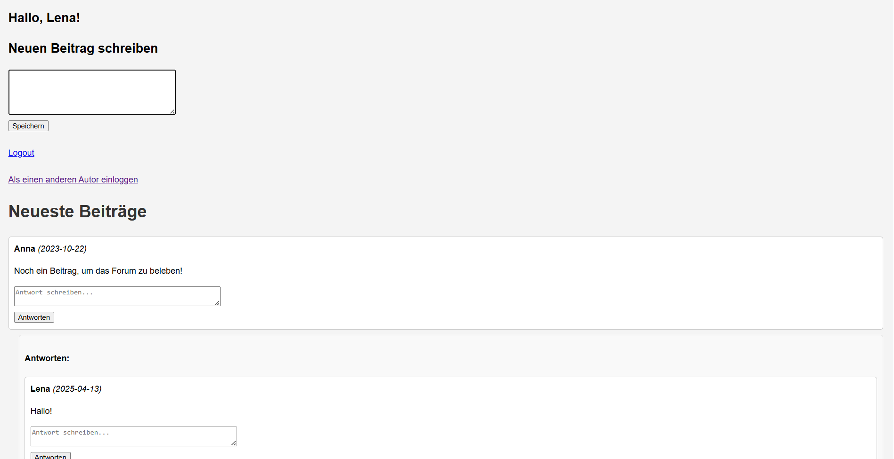

# Forum-Projekt
Ein kleines Webprojekt mit Forum. Man kann neue Beiträge schreiben oder auf andere beantworten.

# Funktionen
- Log-In für verschiedene Benutzer (mit Session)
- **Neuen Beitrag schreiben**
- **Auf andere Beiträge beantworten**

## Technologien
- PHP
- MySQL (phpMyAdmin)
- HTML
- CSS

## Datenbank
Die SQL-Dateien zur Erstellung der Tabelle und der Testdaten befinden sich im Ordner 'sql'.

# Vorschau

## Hinweise
Dieses Projekt wurde im Rahmen eines Lernprojektes erstellt und ist ein einfacher Prototyp ohne Design.
