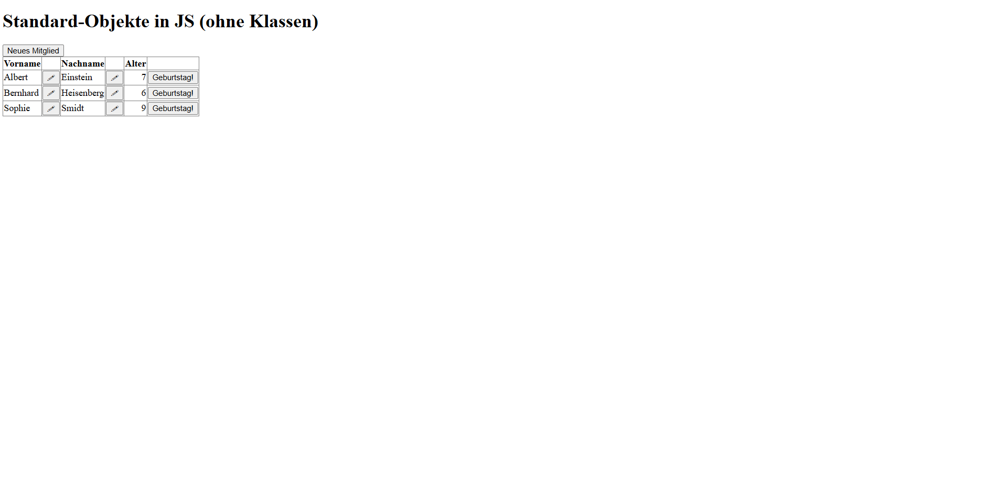

# Kinderverein-Projekt
Ein kleines Webprojekt zur Verwaltung von Kindern in einem Verein. Es zeigt eine Liste mit Vornamen, Nachnamen und Alter der Kinder.

## Funktionen
- Anzeige von Vorname, Nachname und Alter.
- Möglichkeit, **Vor- und Nachnamen zu bearbeiten**.
- Button "**Geburtstag**", um das Alter eines Kinders um 1 Jahr zu erhöhen.

## Technologien
- PHP
- MySQL (phpMyAdmin)
- HTML
- JavaScript

## Datenbank
Die SQL-Dateien zur Erstellung der Tabelle und der Testdaten befinden sich im Ordner 'sql'.

# Vorschau

## Hinweise
Dieses Projekt wurde im Rahmen eines Lernprojektes erstellt und ist ein einfacher Prototyp ohne Design.
