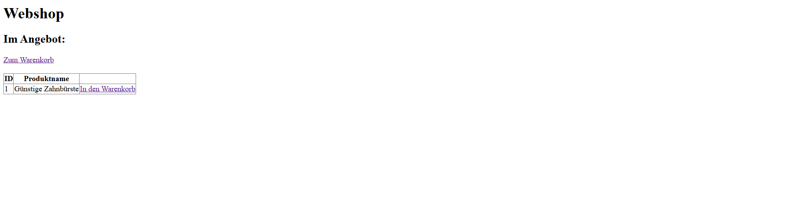

# Webshop-Projekt
Ein kleines Webprojekt zum Kaufen der Waren. Es zeigt bestimmte Waren, man kann diese in Warenkorb hinzufügen. Es gibt Adminbereich, wo Waren verwaltet werden können.

## Funktionen
- Anzeige von Waren
- Möglichkeit, Waren in den Warenkorb hinzufügen
- Anzeige des Warenkorbs
- **Adminbereich:** Möglichkeit, **neues Produkt hinzufügen**
- **Adminbereich:** Möglichkeit, **vorhandenes Produkt zu bearbeiten**
- **Adminbereich:** Anzeige eines bestimmten Produktes(Name, Beschreibung)

## Technologien
- PHP
- MySQL (phpMyAdmin)
- HTML

## Datenbank
Die SQL-Dateien zur Erstellung der Tabelle und der Testdaten befinden sich im Ordner 'sql'.

# Vorschau

## Hinweise
Dieses Projekt wurde im Rahmen eines Lernprojektes erstellt und ist ein einfacher Prototyp ohne Design.
